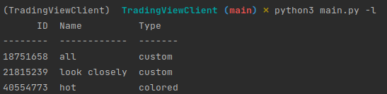
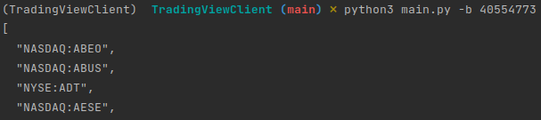
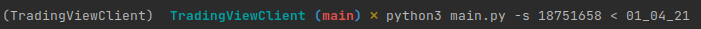
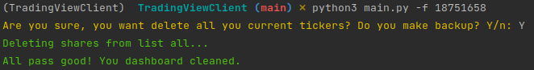

## App for add or remove tickers lists in TradingView.com
Works well with my other app - [SharesParser](https://github.com/Spehof/SharesParser) (tickers parser for finviz.com)

### Instalation
1. Cloning this repo
   ``git clone https://github.com/Spehof/TradingViewClient.git ``
2. Install requirements
   ``pip install -r requirements.txt``   
3. Create ``cookie.txt`` file and write you cookie from TradingView authorization  
4. For help  ``python3 main.py -h``
   
### Program options
``-l, --list`` get all existing lists tickers information  

``-b , --backup`` print all tickers from you account to ``STDOUT``
(usually using with redirection ``STDOUT``)  

``-s, --set`` set all tickers to of said TradingView symbols list from stdin  

``-p, --ping`` check connection to site with current cookie (still not working)  

``-f, --free`` remove all tickers from of said symbols list

### How it works?
* Script get tickers from ``STDIN`` and see in file ``tconfig.json`` (tickers config)
* If the program finds tickers in this file, then get exchange from file (you can specify exchange for any tickers in this file)
* if the program not finds tickers in this file, then doing get request to TradingView and get first element from answer tickers array and write this in ``tconfig.json``

## Examples
#### My ticker lists  

#### Backup all tickers from list 

#### Set tickers from ``STDIN`` to list 

#### Delete all tickers from list 

Feel free for remarks, addendum and ideas for improving!